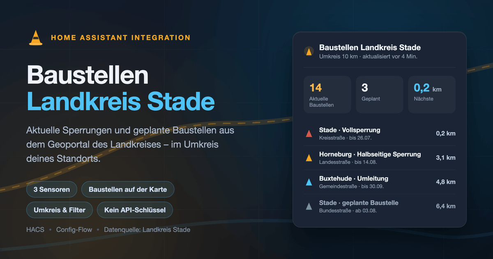

# Baustellen Landkreis Stade – Home Assistant Integration



Zeigt die aktuellen und geplanten Baustellen und Sperrungen im Landkreis Stade in
Home Assistant an. Datengrundlage ist derselbe ArcGIS-Dienst, der auch die
[Karte „Baustellen und Sperrungen im Landkreis Stade“](https://lkstade.maps.arcgis.com/apps/instant/sidebar/index.html?appid=6c6c67e8b366480586f363c17056d325)
des Landkreises speist.

## Funktionen

- **Umkreissuche** um einen frei wählbaren Punkt (Standard: Standort der
  Home-Assistant-Instanz), Radius per Karte einstellbar.
- **Drei Sensoren**
  | Entität | Zustand | Attribute |
  | --- | --- | --- |
  | `sensor.…_aktuelle_baustellen` | Anzahl der laufenden Baustellen | Liste der 25 nächstgelegenen Baustellen |
  | `sensor.…_geplante_baustellen` | Anzahl der Baustellen im Vorschauzeitraum | Liste der geplanten Baustellen |
  | `sensor.…_nachste_baustelle` | Entfernung der nächsten laufenden Baustelle in km | Details zu dieser Baustelle |
- **Eine `geo_location`-Entität pro Baustelle** – damit erscheinen die Baustellen
  automatisch auf der Karten-Karte (Map-Card mit Quelle `baustellen_stade`) und
  lassen sich per Geofence-Automation auswerten. Der Zustand ist die Entfernung
  in Kilometern, Beginn, Ende, Umleitung, Hinweis und Beschreibung stehen als
  Attribute bereit.
- **Filter** nach Kategorie (z. B. nur `Vollsperrung`) und Straßentyp
  (z. B. nur `Kreisstraße` und `Bundesstraße`).
- Abrufintervall: 30 Minuten.

## Installation

### HACS (benutzerdefiniertes Repository)

1. HACS → Integrationen → ⋮ → *Benutzerdefinierte Repositories*
2. Dieses Repository als Kategorie *Integration* hinzufügen
3. „Baustellen Landkreis Stade“ installieren und Home Assistant neu starten

### Manuell

Den Ordner `custom_components/baustellen_stade` in das `config`-Verzeichnis von
Home Assistant kopieren, sodass `config/custom_components/baustellen_stade/`
entsteht, und Home Assistant neu starten.

## Einrichtung

*Einstellungen → Geräte & Dienste → Integration hinzufügen → „Baustellen
Landkreis Stade“*

| Option | Bedeutung | Standard |
| --- | --- | --- |
| Standort und Umkreis | Bezugspunkt der Entfernungsberechnung, Radius per Kartenkreis | Standort der Instanz, 10 km |
| Vorschau für geplante Baustellen | Wie viele Tage im Voraus noch nicht begonnene Baustellen erfasst werden (`0` = nur laufende) | 14 Tage |
| Kategorien | Einschränkung auf bestimmte Kategorien (leer = alle) | alle |
| Straßentypen | Einschränkung auf bestimmte Straßentypen (leer = alle) | alle |

Radius, Vorschauzeitraum und Filter lassen sich jederzeit über *Konfigurieren*
am Eintrag ändern.

## Beispiele

Baustellen auf der Karte anzeigen:

```yaml
type: map
geo_location_sources:
  - baustellen_stade
```

Benachrichtigung, sobald eine neue Vollsperrung in der Nähe auftaucht:

```yaml
automation:
  - alias: Neue Baustelle in der Nähe
    triggers:
      - trigger: numeric_state
        entity_id: sensor.baustellen_landkreis_stade_aktuelle_baustellen
        above: 0
    conditions:
      - condition: template
        value_template: >-
          {{ trigger.to_state.state | int > trigger.from_state.state | int }}
    actions:
      - action: notify.persistent_notification
        data:
          title: Neue Baustelle
          message: >-
            
            {{ b.kategorie }} in {{ b.ort or b.strassentyp }}
            ({{ b.entfernung }} km): {{ b.beschreibung }}
```

## Datenquelle und Hinweise

- Die Daten stammen aus dem öffentlich zugänglichen FeatureServer
  `Baustellen_Sperrungen_Strecken_für_ArcGIS_Online_Sicht_Layer` des Landkreises
  Stade (ArcGIS Online, Organisation `gj4UKoDigJC9AuBF`). Es wird kein API-Schlüssel
  benötigt.
- Der Datensatz enthält ausschließlich Meldungen des Landkreises Stade; außerhalb
  des Kreisgebiets liefert die Integration keine Treffer.
- Beginn- und Enddatum sind tagesgenau. Eine Baustelle gilt als *aktiv*, solange
  das aktuelle Datum zwischen Beginn und Ende liegt.
- Beendete Baustellen werden beim nächsten Abruf automatisch entfernt – die
  zugehörigen `geo_location`-Entitäten verschwinden dann ebenfalls.
- Diese Integration steht in keiner Verbindung zum Landkreis Stade.

## Fehlersuche

Ausführliche Protokollierung aktivieren:

```yaml
logger:
  logs:
    custom_components.baustellen_stade: debug
```

Über *Geräte & Dienste → Baustellen Landkreis Stade → Diagnose herunterladen*
lässt sich der komplette abgerufene Datenbestand exportieren.

## Bildmaterial

Die Grafiken in `images/` entstehen aus den mitgelieferten HTML-Quellen und
lassen sich jederzeit neu erzeugen:

```bash
cd images && ./render.sh
```

`icon.png` (256 px) und `icon@2x.png` (512 px) erfüllen die Vorgaben von
[home-assistant/brands](https://github.com/home-assistant/brands) – dort
eingereicht, zeigen HACS und Home Assistant das Icon der Integration an.
